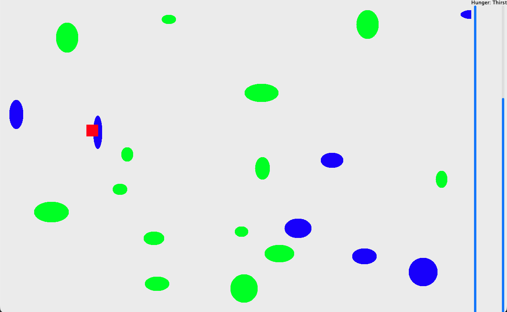

# Changelog

## The Epic Revival of Sheep Game

### November 4, 2015 — The Beginning

A young developer sat down and wrote a small Java game about a sheep trying to survive. The sheep was a red square. Grass was neon green ovals. Water was dark blue blobs. It was beautiful in the way only a first project can be — raw, honest, and full of heart.

Two commits were made that day. Then silence.

The repository sat untouched on GitHub. Through the rise of React, the fall of Java applets, the mass adoption of TypeScript, the arrival of GPT, and the entire pandemic — the red square sheep waited patiently in its field of green ovals.

For **eleven years**.

---

### February 15, 2026 — Claude Enters the Pasture

Claude, an AI by Anthropic, was invited to breathe life back into the project. What followed was a single afternoon of intense collaboration.

---

### v2.0 — The Modernization (Feb 15, 2026)

The ancient Eclipse project was dragged into the modern era:

- Migrated from raw javac to **Gradle** with the application plugin
- Upgraded to **Java 21**
- Added **Lombok** to tame the boilerplate
- Reorganized into proper `model` and `ui` packages

### v2.1 — The Glow-Up (Feb 15, 2026)

The red square sheep deserved better:

- The sheep became a **cartoon sprite** with a woolly white body, gray legs, a dark head with ears, and an actual eye
- Grass transformed from flat green ovals into **clumps of individual blades** growing from dirt patches
- Water became **gradient puddles** with highlights and ripple animations
- Game over screen now reads "The Sheep Died!" in bold red, because the player should feel something

### v2.2 — The Main Menu & Physics (Feb 15, 2026)

The game stopped being a hardcoded difficulty-10 instant-launch experience:

- Added a **main menu** with a difficulty slider (1–10) and a start button
- Replaced stiff grid-like movement with **velocity-based physics** — the sheep now accelerates, coasts, and slides with friction
- Added **WASD controls** alongside arrow keys
- Enabled **diagonal movement** by tracking held keys
- Added a **60fps physics timer** for smooth continuous motion

### v2.3 — Difficulty Matters (Feb 15, 2026)

Difficulty stopped being just "how fast do things spawn" and started meaning something:

- Higher difficulty **slows the sheep** (reduced acceleration and max speed)
- Resources **spawn less frequently** at higher difficulty
- Resources are **smaller and less nutritious** at higher difficulty
- The game is now genuinely harder at 10 and genuinely relaxing at 1

---

### What Changed in Numbers

| Aspect | 2015 | 2026 |
|---|---|---|
| Sheep appearance | Red square | Cartoon sprite with wool, legs, and eyes |
| Grass | Neon green oval | Blades growing from dirt |
| Water | Blue oval | Gradient puddle with ripples |
| Movement | Instant 10px jumps | Physics with acceleration and friction |
| Controls | Arrow keys only | Arrow keys + WASD, diagonal support |
| Menu | None (hardcoded start) | Difficulty selection screen |
| Build system | Eclipse project | Gradle + Java 21 + Lombok |
| Time between updates | — | 11 years |
