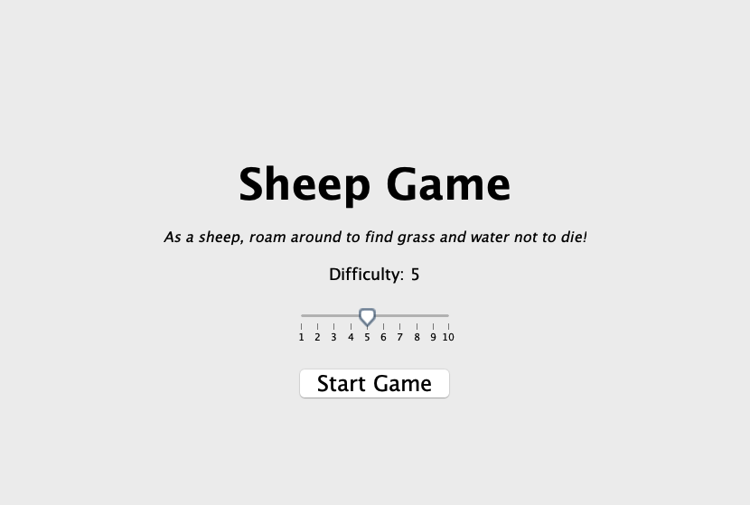
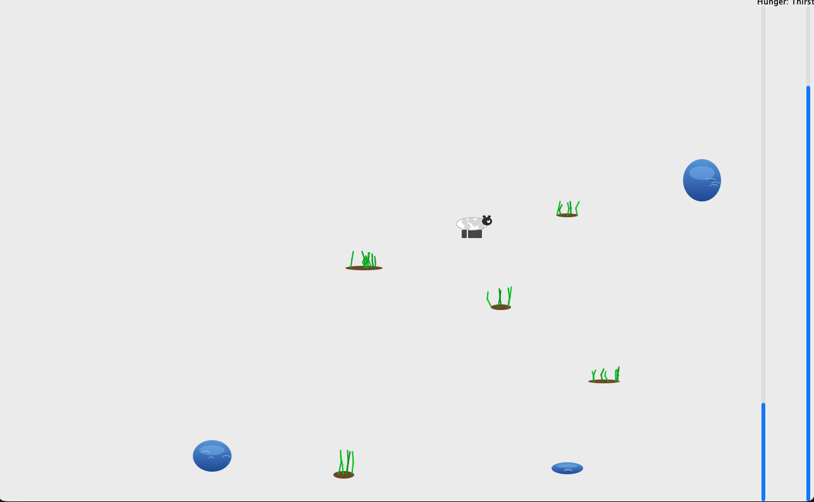

# Sheep Game

A survival game where you control a sheep trying to stay alive. Your sheep gets hungrier and thirstier over time — eat grass and drink water to survive as long as you can.





## How to Play

- Use **arrow keys** or **WASD** to move the sheep
- Eat **grass** (green patches) to reduce hunger
- Drink **water** (blue puddles) to reduce thirst
- If hunger or thirst reaches the maximum, the sheep dies

The sheep has momentum-based movement: it accelerates when you hold a direction and coasts when you release. Diagonal movement is supported by holding two keys.

## Difficulty

Choose a difficulty level (1–10) from the main menu. Higher difficulty means:

- The sheep moves slower
- Resources spawn less frequently
- Resources are smaller and less nutritious

## Running the Game

Requires Java 21.

```sh
./gradlew run
```
